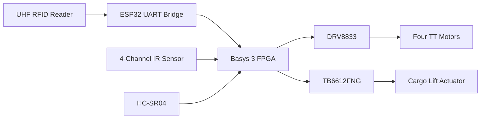
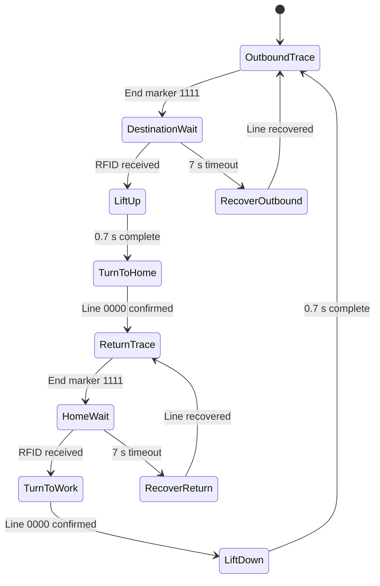

# FPGA-Based Autonomous AGV with RFID Navigation and Automatic Loading

An autonomous guided vehicle (AGV) implemented in Verilog on the Digilent Basys 3 FPGA. The robot follows a marked route using four IR sensors, identifies stations through UHF RFID, automatically lifts or lowers cargo, returns to its starting point, avoids obstacles, and recovers when it accidentally loses the track.

## Project Overview

Conventional AGVs often rely on a separate microcontroller running sequential software. This project explores a hardware-oriented control system in which sensor processing, PID steering, PWM generation, UART reception, safety logic, and the main state machine operate concurrently on an FPGA.

The AGV completes the following cycle:

1. Follow the line toward the destination.
2. Detect the `1111` end-of-line pattern and stop.
3. Wait for a UHF RFID reading received from an ESP32 over UART.
4. Raise the cargo platform for 0.7 seconds.
5. Rotate until the four IR sensors confirm that the route has been found again.
6. Follow the line back to the home station.
7. Confirm the home station through RFID.
8. Rotate toward the work route and lower the cargo.
9. Begin the next transport cycle.

If no RFID data is received within seven seconds at an apparent endpoint, the controller treats the event as an accidental track loss and rotates until it recovers the route.

## Key Features

- FPGA-based autonomous control on a Basys 3 board
- Four-channel IR line sensing
- PID/PD steering with independent left and right motor speeds
- UHF RFID station recognition through an ESP32 UART bridge
- Automatic cargo lifting and lowering
- Route-based turning instead of a fixed turn timer
- HC-SR04 ultrasonic emergency stop below 15 cm
- Seven-second RFID timeout and automatic track recovery
- 20 ms line confirmation to reduce false detections
- LED-based UART, state, actuator, obstacle, and recovery debugging
- QSPI configuration settings for standalone FPGA startup

## Hardware

- Digilent Basys 3 FPGA board
- M5Stack UHF RFID Unit (JRD-4035)
- Texas Instruments RI-UHF-00C01-03 UHF RFID tags/stickers
- ESP32 for RFID-to-UART communication
- Four-channel IR line sensor module (AM-IRS4D)
- HC-SR04 ultrasonic distance sensor
- Four TT geared DC motors
- Cargo lift actuator
- DRV8833 motor driver for the wheel motors
- TB6612FNG motor driver for the lift actuator
- Two 2S LiPo battery packs
- Two MB102 3.3 V/5 V breadboard power-supply modules

> **Electrical safety:** All modules must share the required common ground. Do not connect a 5 V HC-SR04 Echo signal directly to a 3.3 V FPGA input; use an appropriate level shifter or voltage divider. Use a properly rated battery protection, switch, wiring, and fuse arrangement for the final build.

## System Architecture



## Control Flow



## PID Line Control

The four IR sensor inputs are converted into a signed position error from `-3` to `+3`. The controller updates every 1 ms and applies:

```text
correction = KP × error + KI × integral + KD × derivative
left_speed  = base_speed - correction
right_speed = base_speed + correction
```

Current tuning values:

| Parameter | Value |
|---|---:|
| Base speed | 170/255 |
| Rotation speed | 250/255 |
| KP | 22 |
| KI | 0 |
| KD | 14 |
| PID update interval | 1 ms |

The integral term is currently disabled, so the implemented behavior is effectively PD control. Motor outputs are saturated to the valid 8-bit range of 0–255.

## FPGA Pin Map

| Function | Top-level signal | Basys 3 pin |
|---|---|---|
| 100 MHz clock | `clk` | W5 |
| Left motor input 1 | `in1` | J1 |
| Left motor input 2 | `in2` | L2 |
| Right motor input 1 | `in3` | J2 |
| Right motor input 2 | `in4` | G2 |
| IR sensor 1 | `s[3]` | L17 |
| IR sensor 2 | `s[2]` | M19 |
| IR sensor 3 | `s[1]` | P17 |
| IR sensor 4 | `s[0]` | R18 |
| HC-SR04 Trigger | `trig` | K17 |
| HC-SR04 Echo | `echo` | M18 |
| ESP32 UART TX to FPGA RX | `JA_RX` | N17 |
| Actuator AIN1 | `stepper_a1` | A15 |
| Actuator AIN2 | `stepper_a2` | A17 |
| Actuator PWMA | `stepper_b1` | B16 |
| Actuator STBY | `stepper_b2` | C15 |

## LED Debug Map

| LEDs | Meaning |
|---|---|
| `LED[7:0]` | Last byte received through RFID/UART |
| `LED[11:8]` | Current finite-state-machine state |
| `LED12` | Lift actuator active |
| `LED13` | Waiting for RFID |
| `LED14` | Obstacle detected within 15 cm |
| `LED15` | Track-recovery mode active |

## Source Files

| File | Purpose |
|---|---|
| `top_car_controller.v` | Main AGV state machine, PID logic, safety control, and module integration |
| `motor_pwm.v` | Independent PWM and direction control for each wheel side |
| `stepper_driver.v` | TB6612FNG direction, enable, and PWM control for the lift actuator |
| `uart_rx.v` | 115200-baud UART receiver for RFID data from the ESP32 |
| `ultrasonic_sensor.v` | HC-SR04 trigger generation and distance measurement |
| `constraints.xdc` | Basys 3 pin assignments and QSPI configuration properties |

## UART Configuration

The UART receiver is configured for:

- 115200 baud
- 8 data bits
- No parity
- 1 stop bit
- 100 MHz FPGA system clock
- `CLKS_PER_BIT = 868`

Any successfully received UART byte is treated as an RFID recognition event. The most recently received byte is displayed on `LED[7:0]`.

## Building in Vivado

1. Create a new Vivado RTL project targeting the Basys 3 device (`xc7a35tcpg236-1`).
2. Add all `.v` files as design sources.
3. Add `constraints.xdc` as the constraints file.
4. Set `top_car_controller` as the top module.
5. Run synthesis, implementation, and bitstream generation.
6. Program the FPGA through Hardware Manager.
7. For standalone operation, program the onboard QSPI configuration flash with the generated bitstream.

## Important Calibration Points

The following constants in `top_car_controller.v` should be tuned for the final chassis and track:

- `BASE_SPEED` and `ROTATE_SPEED`
- `KP`, `KI`, and `KD`
- `LIFT_TIME`
- `RFID_WAIT_TIME`
- `LINE_CONFIRM_TIME`
- Ultrasonic emergency-stop distance

IR polarity and sensor-pattern mapping can vary between modules. Confirm that `1111` represents the endpoint and `0000` represents the line-reacquisition pattern on your physical setup before operation.

## Repository Topics

`fpga` `verilog` `basys3` `agv` `robotics` `line-following` `pid-control` `rfid` `uart` `ultrasonic-sensor` `vivado` `autonomous-robot`

## Future Improvements

- Add wheel encoders for closed-loop speed and distance control
- Validate RFID tag IDs instead of accepting any received byte
- Add checksums or a structured UART packet format
- Add battery-voltage and motor-current monitoring
- Replace timed actuator movement with limit switches
- Add simulation testbenches for each module and the complete transport cycle
- Add a physical emergency-stop switch and fused power distribution

## License

This project is provided for educational and research purposes. Add a license file before redistributing or incorporating the design into another project.
